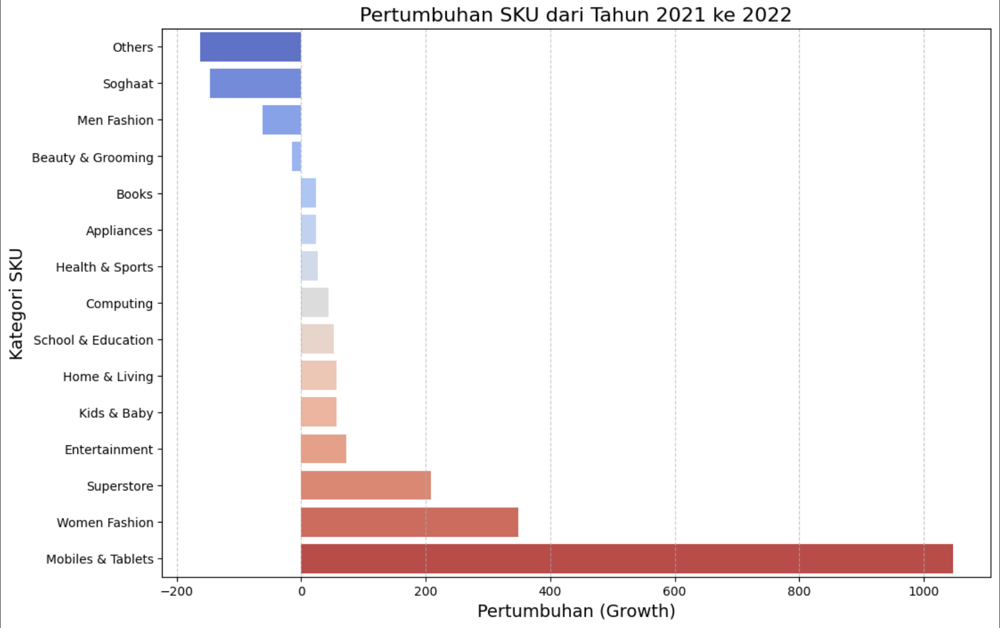
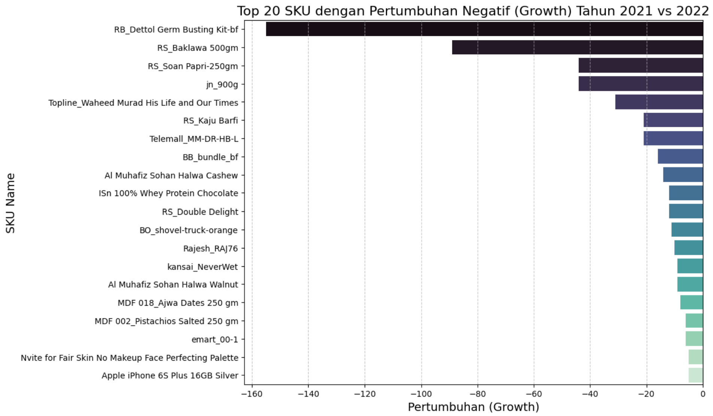

# OrderAnalytics

## Dear Data Analyst

Akhir tahun ini, perusahaan akan memberikan hadiah bagi pelanggan yang memenangkan **Kompetisi Festival Akhir Tahun**. Tim Marketing membutuhkan bantuan untuk menentukan perkiraan hadiah yang akan diberikan kepada pemenang kompetisi tersebut.

### Detail Permintaan:
- Hadiah akan diambil dari **TOP 5 Produk dari Kategori Mobiles & Tablets** selama tahun 2022.
- Produk yang dipilih harus memiliki jumlah kuantitas penjualan tertinggi dengan status penjualan **valid = 1**.
- Mohon kirimkan data tersebut ke Tim Marketing **sebelum akhir bulan ini**.

Atas bantuan yang diberikan, kami mengucapkan terima kasih.

**Best regards,**  
Tim Marketing

---

## Dear Data Analyst

Menindaklanjuti meeting gabungan **Tim Warehouse** dan **Tim Marketing**, kami menemukan bahwa ketersediaan stok produk dengan **Kategori Others** pada akhir 2022 masih cukup banyak.

Kami mohon bantuan untuk melakukan pengecekan **data penjualan** kategori tersebut dengan membandingkan **tahun 2021** dan **2022** secara **kuantitas penjualan**. Dugaan sementara kami, telah terjadi penurunan kuantitas penjualan pada tahun 2022 dibandingkan 2021. (Mohon juga untuk menampilkan data dari **ke-15 kategori**).

### Tindakan yang Diperlukan:
- Jika memang terjadi penurunan kuantitas penjualan pada **Kategori Others**, mohon bantuan untuk menyediakan **data TOP 20 nama produk** yang mengalami penurunan paling tinggi pada 2022 dibandingkan 2021.
- Data ini akan digunakan sebagai bahan diskusi pada meeting selanjutnya.

Mohon bantuan untuk mengirimkan data tersebut paling lambat **4 hari** dari hari ini.  
Atas bantuan yang diberikan, kami mengucapkan terima kasih.

**Best regards,**  
**Tim Warehouse**

---

## Dear Data Analyst,

Terkait ulang tahun perusahaan yang akan datang dalam **2 bulan mendatang**, **Tim Digital Marketing** akan memberikan informasi promo bagi pelanggan pada akhir bulan ini.

### Kriteria Data yang Dibutuhkan:
- Pelanggan yang sudah melakukan **check-out** namun **belum melakukan pembayaran** (is_gross = 1) selama tahun 2022.
- Data yang dibutuhkan adalah **ID Customer** dan **Registered Date**.

Mohon bantuan untuk mengirimkan data tersebut ke **Tim Digital Marketing** sebelum akhir bulan ini.

Atas bantuan yang diberikan, kami mengucapkan terima kasih.

**Best regards,**  
**Tim Digital Marketing**

---
Hasil : 

## Dear Data Analyst,

Pada bulan **October hingga Desember 2022**, kami melakukan **campaign** setiap hari **Sabtu dan Minggu**. Kami hendak menilai apakah campaign tersebut berdampak pada **kenaikan penjualan** (before_discount).

### Data yang Dibutuhkan:
1. **Rata-rata harian penjualan weekends** (Sabtu dan Minggu) vs **rata-rata harian penjualan weekdays** (Senin-Jumat) per bulan selama periode tersebut. Mohon analisis apakah ada peningkatan penjualan pada masing-masing bulan tersebut.
2. **Rata-rata harian penjualan weekends** vs **rata-rata harian penjualan weekdays** secara keseluruhan selama **3 bulan** (October - Desember 2022).

Mohon bantuan untuk mengirimkan data tersebut paling lambat **minggu depan**.

Atas bantuan yang diberikan, kami mengucapkan terima kasih.

**Best regards,**  
**Tim Campaign**

---

